# 扫描线Z缓冲器算法的实现

Version：2016年12月

注：本文中的算法描述对应版本为commit #649f2e36。截图对应版本为commit #0916edf6。

## 1 程序内容

编程实现扫描线z缓冲器算法（不调用已有的z缓冲器算法API函数或高级图形库）。

## 2 开发环境

* Hardware
  + Intel(R) Core(TM) i7-6600U CPU @ 2.60GHz
  + Intel(R) HD Graphics 520
  + 16GB RAM
* Operating System
  + Windows 10 家庭版 版本1607
* IDE
  + Microsoft Visual Studio Community 2015 版本 14.0.25123.00 Update 2
* Version Control System
  + Git
* Programming Language, Library and API
  + C++11
  + C++ STL
  + Win32 API

## 3 数据结构

### 3.1 WIN32 图形界面相关

```cpp
template <typename DERIVED_TYPE>
class BaseWindow
{
public:
    static LRESULT CALLBACK WindowProc(HWND hwnd, UINT uMsg,
                                       WPARAM wParam, LPARAM lParam);

    BOOL Create(PCWSTR lpWindowName, DWORD dwStyle, DWORD dwExStyle = 0,
                int x = CW_USEDEFAULT, int y = CW_USEDEFAULT,
                int nWidth = CW_USEDEFAULT, int nHeight = CW_USEDEFAULT,
                HWND hWndParent = NULL, HMENU hMenu = NULL);

protected:
    virtual PCWSTR ClassName() const = 0;
    virtual LRESULT HandleMessage(UINT uMsg, WPARAM wParam, LPARAM lParam) = 0;
    // Other methods and members are omitted.
};
```

抽象基类模版，用于创建窗口、响应窗口创建的Windows消息事件。

```cpp
class MainWindow : public BaseWindow<MainWindow>
{
public:
    LRESULT HandleMessage(UINT uMsg, WPARAM wParam, LPARAM lParam);
    void OpenObjFile();

private:
    OffscreenBuffer m_buffer;
    ObjModel m_objModel;
    // Other methods and members are omitted.
};
```

继承于基类的子类，用于打开obj文件、响应绘制相关的Windows消息事件。包含两个私有成员OffscreenBuffer m_buffer和ObjModel m_objModel，用于从obj模型生成图像。

### 3.2 图像绘制相关

```cpp
class ObjModel
{
public:
    void LoadFromObjFile(const std::wstring &filePath);
    void SetModelScale(const OffscreenBuffer &buffer, double scaleFactor = 1.0);
    void SetBuffer(OffscreenBuffer &buffer);

private:
    // right-hand coordinate system, sequentially numbered, starting with 1
    // This number sequence continues even when vertex data is separated by
    // other data.
    std::vector<PositionF> m_vertices;  // geometric vertices

    std::vector<PositionF> m_scaledVertices;

    struct FaceNode
    {
        int v;
        int vt;
        int vn;
    };

    std::vector<std::vector<FaceNode>> m_faces;

    struct BoundingBox
    {
        double xmin;
        double xmax;
        double ymin;
        double ymax;
        double zmin;
        double zmax;

        BoundingBox() : xmin(DBL_MAX), xmax(DBL_MIN),
                        ymin(DBL_MAX), ymax(DBL_MIN),
                        zmin(DBL_MAX), zmax(DBL_MIN)
        { }
    };

    BoundingBox m_box;
    RECT m_boundingRect{ };

    template <typename T = double>
    struct Plane
    {
        T a;
        T b;
        T c;
        T d;
    };

    template <typename T>
    Plane<typename T::value_type> GetPlane(T p1, T p2, T p3);

    struct PlaneNode
    {
        Plane<> plane;
        UINT32 id;
        UINT32 diffy;
        Color color;
    };
    std::vector<std::vector<PlaneNode>> m_planes;

    struct EdgeNode
    {
        double xtop;
        double dx;
        UINT32 diffy;
        UINT32 planeId;
    };
    std::vector<std::vector<EdgeNode>> m_edges;

    struct ActiveEdgePairNode
    {
        struct Edge
        {
            double x;
            double dx;
            UINT32 diffy;
        } l, r;
        double zl;
        double dzx;
        double dzy;
        UINT32 planeId;
    };

    // Initialize plane tables and edge tables.
    void InitTables();
    // Other methods and members are omitted.
};
```

模型相关操作的类，用于读取模型数据、进行三维模型变换、实现从三维模型到二维屏幕空间的变换操作。包括许多扫描线Z缓冲器算法用到的数据结构。

```cpp
class OffscreenBuffer
{
public:
    void Resize(INT32 width, INT32 height);
    void SetPixel(INT32 x, INT32 y, const Color &color);
    void SetRow(INT32 y, const std::vector<Color> &row);
    void OnPaint(HDC hdc, LONG width, LONG height);
    // Other methods and members are omitted.
};
```

二维图像绘制的类，用于保存生成的二维图像和将图像绘制到屏幕上。

### 3.3 辅助功能相关

```cpp
class FloatingPoint
```

用于浮点数相等比较的辅助类。

```cpp
int DebugPrint(format, ...)
```

用于格式化输出调试信息的辅助函数。

```cpp
struct Color
```

用于存储颜色信息的辅助类。

## 4 算法说明

### 4.1 文件读取

通过Windows的COM接口创建FileOpenDialog对象来实现图形界面的文件打开窗口，利用文件打开窗口获取文件路径后，即可通过ObjModel::LoadFromObjFile方法将数据读取并加载到ObjModel的成员中。由于计算时只需要定点坐标和各个面的顶点构成信息，故在读取时可以忽略其它内容，加快处理速度。

读取时使用std::ifstream和std::istringstream进行文本的读入和解析，只需解析格式为“v x y z w”的顶点和“f  v1/ vt1/vn1  v2/vt2/vn2  v3/vt3/vn3 ...”的面信息即可。

在读取顶点坐标时，同步更新物体的包围盒BoundingBox m_box的大小，方便之后根据包围盒的大小将物体进行适当的缩放。

在读取面信息时，由于最后一个顶点与第一个顶点也构成面的一条边，故每当读取完一个面的所有顶点，就把第一个顶点复制并加到顶点列表的最后，方便之后在生成边表时遍历面的所有边。

### 4.2 模型变换（扫描线Z缓冲器算法）

根据Windows消息事件队列，在收到不同消息时做出相应的处理。

在收到WM_SIZE消息时进行模型的变换和扫描转换：

* 首先将图像缓存m_buffer的大小改变为窗口大小。
* 然后将三维模型m_objModel根据窗口大小进行平移和缩放，使其能够大小合适的显示在屏幕中央。
  + 利用之前得到的包围盒，可以求出物体的中心，平移物体使其中心与坐标系原点重合；
  + 根据窗口大小，将物体进行缩放，使其长度较大的一维（x或y）占满窗口该维度的scaleFactor倍（=1时即占满整个维度空间，<1时则物体周围有空余空间，>1时则只能显示部分物体），从而使整个物体都能显示在窗口内；
  + 平移物体使其中心与窗口中心在xoy平面上的投影重合。
* 最后用扫描线z缓冲器算法进行三维模型m_objModel到二维屏幕空间的变换及消影，并将结果存储至m_buffer中进行缓存。具体算法的过程与课堂上讲述的基本相同。
  + 首先建立分类的多边形表和边表。
    - 由于我的三维变换后的坐标系三个坐标轴的正方向分别为：x向右、y向下、z向屏幕内，故多边形表和边表以及后面的动态多边形表和边表均按照ytop（即ymin）存放。
    - 每个多边形的颜色利用其面法向量与光照方向向量的夹角计算，用以在显示时区分不同的面。
    - 多边形和边跨越的扫描线数均包含最上端顶点及最下端顶点所在的扫描线，对应动态表中当其值减为0时，移除该边。
    - 边表和动态边表中dx=1/k（因为y轴与课件中相比反向）。
    - 动态边表中dzy=-a/c（因为y轴与课件中相比反向）。
  + 扫描顺序从上到下（y从小到大）逐行扫描。y的初值为min(m_boundingRect.top, 0)，这样当物体大小超出屏幕范围时，最上端的部分仍能够正常显示，否则最上端的面会有部分缺失。y的终值为屏幕高度height，物体超出height的部分直接被忽略。
  + 在处理最上面一条扫描线之前，动态多边形表和边表为空。在处理每条扫描线时，作如下工作：
    - 把帧缓冲器的相应行置成底色。
    - 把z缓冲器的各个单元置成最大值（z轴方向与课件相反），表示离视点最远。
    - 判断扫描线所在行是否有多边形，这里根据之前求出的包围盒可以跳过屏幕最上端到物体最上端和屏幕最下端到物体最下端的处理，直接将背景色输出。
    - 检查分类的多边形表，如果有新的多边形涉及该扫描线，则把它放入动态多边形表中。多边形在动态多边形表中的次序是不重要的。
      * 如果有新的多边形加入到动态多边形表中，则把该多边形在oxy平面上的投影和扫描线相交的边加入到动态边表中。（注：动态边表中存放的是边对，这就限制了算法只能处理凸多边形和部分凹多边形（反例如两个重叠的菱形），如果想要处理任意多边形，就需要将数据结构边对改成边链表分类多边形表。）
        + 在加入边对时先按照上端顶点的x坐标从小到大排序，x坐标相同时再按照dx从小到大排序。
    - ~~如果有些边在这条扫描线处结束了，而其所在的多边形仍在动态多边形表内，则可以从分类多边形表中找到该多边形在oxy平面上的投影与扫描线相交的新边或边对，修改或加到动态边表中去。边对在动态边表中的次序是不重要的。~~（这一步放到后面做。）
    - 对动态边表中每一个边对进行增量式的深度更新。
      * 从动态边表中取出一个边对，当前扫描线y，深度值z=zl，遍历当前位置x(xl<=x<=xr)：
        + 如果x不在窗口的范围内（即[0, width)区间），则跳过深度比较。否则比较z与当前z缓冲器中的z值depthBuffer[x]，如果z<depthBuffer[x]，则更新z，并将对应像素颜色置为该多边形的颜色。
        + 更新当前像素的深度z=z+dzx。
      * 对动态边表中的每一个边对进行如下修改，修改后的动态边表是下一条扫描线的动态边表。
        + （前面跳过的步骤在这里做。）对于每一条边对可计算dyl=dyl-1，dyr=dyr-1。若更新后的dyl或dyr等于0，即说明这些边在这条扫描线处结束了，相应的边就要从一个边对中去掉，从分类边表中找合适的边来代替。边对在动态边表中的次序是不重要的。
          - 注意在加入新边时，新边的dy值需要减一。因为新边在当前扫描线不需要绘制了。
        + 更新边和下一条扫描线交点的x值xl=xl+dxl，xr=xr+dxr。
        + 更新多边形所在的平面对应下一条扫描线在x=xl处的深度zl=zl+dzx*dxl+dzy。
    - 对动态多边形表中的每一个多边形进行更新。
      * 每一个多边形的dy=dy-1。当dy=0时，该多边形要从动态多边形表中删除。
    - 将生成的帧缓冲器的值写入m_buffer中。

### 4.3 图像输出

在收到WM_PAINT消息时，通过调用Windows GDI的StretchDIBits函数将m_buffer中缓存的图像显示到屏幕上。

## 5 程序使用说明

### 5.1 用户界面使用说明

程序开始运行后首先会弹出文件选择窗口（如图5-1所示），选择合适的obj文件作为模型参数输入程序中。程序限定为只能打开后缀名为.obj类型的文件。

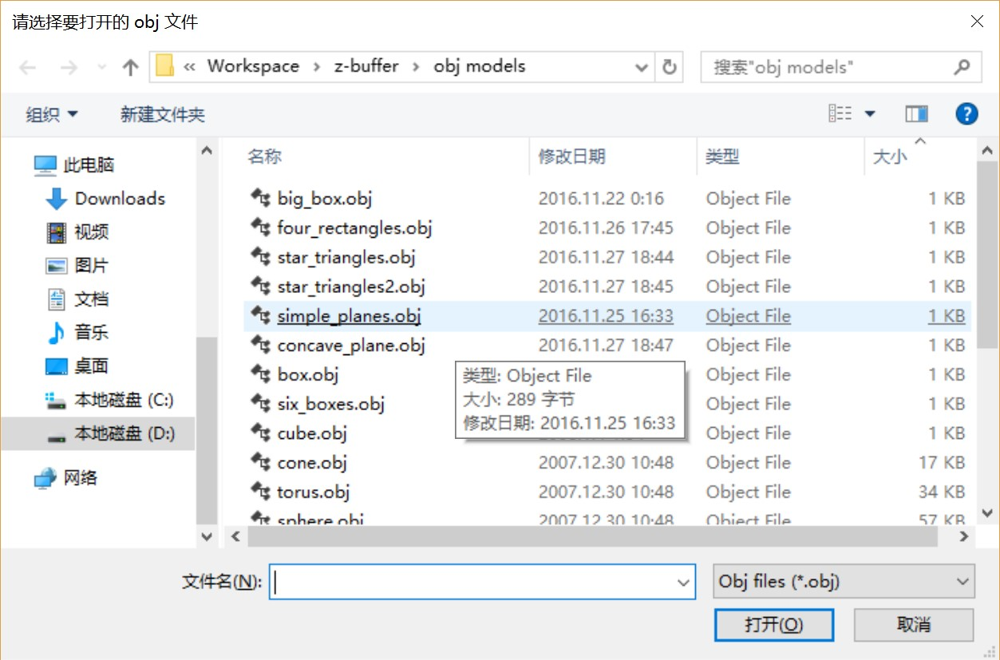

图 5-1 文件打开窗口

在选择完模型文件后，程序主窗口会显示出绘制效果。例如，模型torusknot.obj的显示效果如图5-2所示。

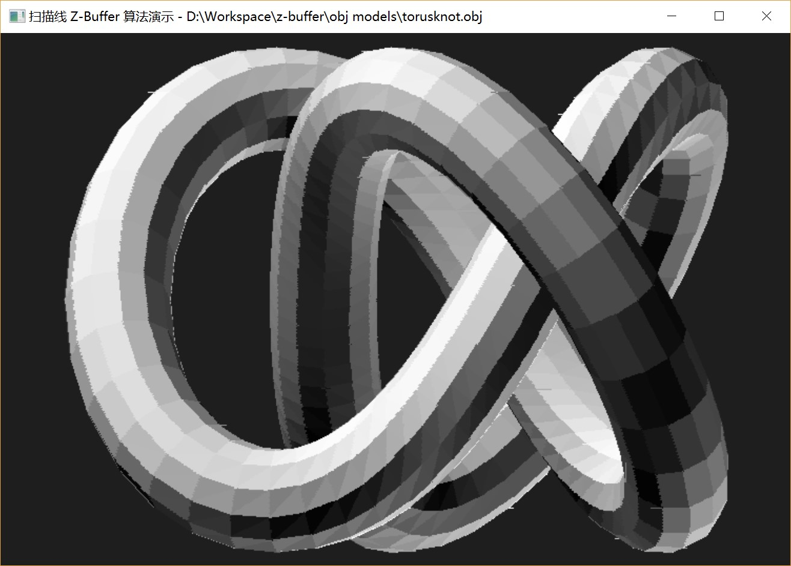

图 5-2 模型torusknot.obj的显示效果

改变窗口的大小时，模型会随窗口一同缩放，保证始终能够保持纵横比完整显示在窗口中，如图5-3所示。

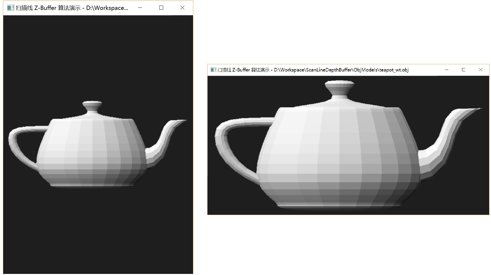

图 5-3 模型teapot_wt.obj在不同窗口比例下的显示效果

程序支持模型缩放功能，按`Z`键和`C`键可以放大或缩小模型。

### 5.2 内部参数设置

由于程序目前规模很小，所以参数就直接在代码里进行设置，没有单独提取到配置文件中。
```cpp
VectorF m_light{1.0, 1.5, 1.0};  // Light direction vector
```
定义在类ObjModel中，表示平行光线入射方向。
```cpp
Color m_planeColor = Color::WHITE;
```
定义在类ObjModel中，表示在光线垂直照射到物体表面时面片的颜色。
```cpp
#define BYTES_PER_PIXEL 4
```
定义在头文件OffscreenBuffer.h中，表示每一个像素占用的字节数。
```cpp
double scaleFactor = 0.95;
```
定义在消息WM_SIZE的响应函数中，表示模型的缩放比例。
```cpp
Color background{30, 30, 30};
```
定义在ObjModel::SetBuffer()函数中，表示窗口的背景颜色。

## 6 运行结果

### 6.1 模型文件

模型文件 | 顶点 | 面 | 描述
---------|------|----|------
concave_plane.obj | 8 | 1 | 凹多边形面片模型，测试凹多边形绘制
simple_planes.obj | 13 | 4 | 基本多边形面片模型
four_rectangles.obj | 16 | 4 | 四个矩形面片模型，测试循环遮挡情况
star_triangles.obj | 16 | 8 | 一个五角星和两个三角形模型，测试互相贯穿情况
cube.obj | 8 | 6 | 立方体模型
cube_big.obj | 8 | 6 | 大立方体模型，测试模型缩放
cube_tilt.obj | 8 | 12 | 倾斜立方体模型
six_boxes.obj | 32 | 30 | 六个立方体模型
cone.obj | 146 | 288 | 圆台模型
cornell_box.obj | 440 | 461 | 开口盒子内放两个球模型
torus.obj | 288 | 576 | 圆环模型
sphere.obj | 482 | 960 | 球模型
teapot.obj | 530 | 992 | 茶壶模型
teapot_wt.obj | 1292 | 2464 | 无孔茶壶模型
desk.obj | 2296 | 2438 | 写字台模型
torusknot.obj | 1440 | 2880 | 环形结模型
flowers.obj | 7608 | 4061 | 花瓶插花模型
venus.obj | 19755 | 43357 | 维纳斯像模型
bunny.obj | 34834 | 69451 | 兔子模型
bunny_wt.obj | 34834 | 69664 | 无孔兔子模型

### 6.2 部分模型效果截图

在Release模式下使用/O2进行编译，面片数少于4000左右的图像可以流畅显示并缩放，维纳斯模型和兔子模型在缩放时有一定延迟。以下是部分模型显示的结果。

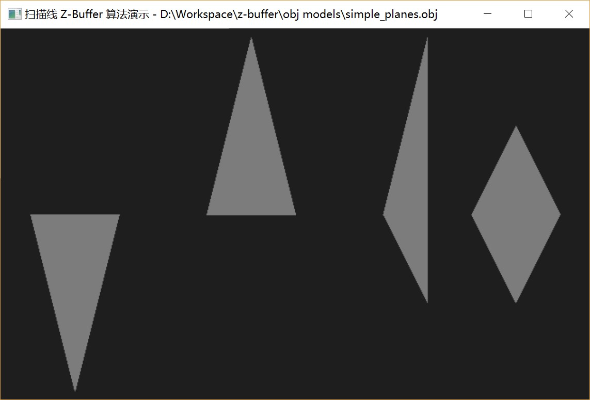

图 6-1 simple_planes.obj


图 6-2 star_triangles.obj

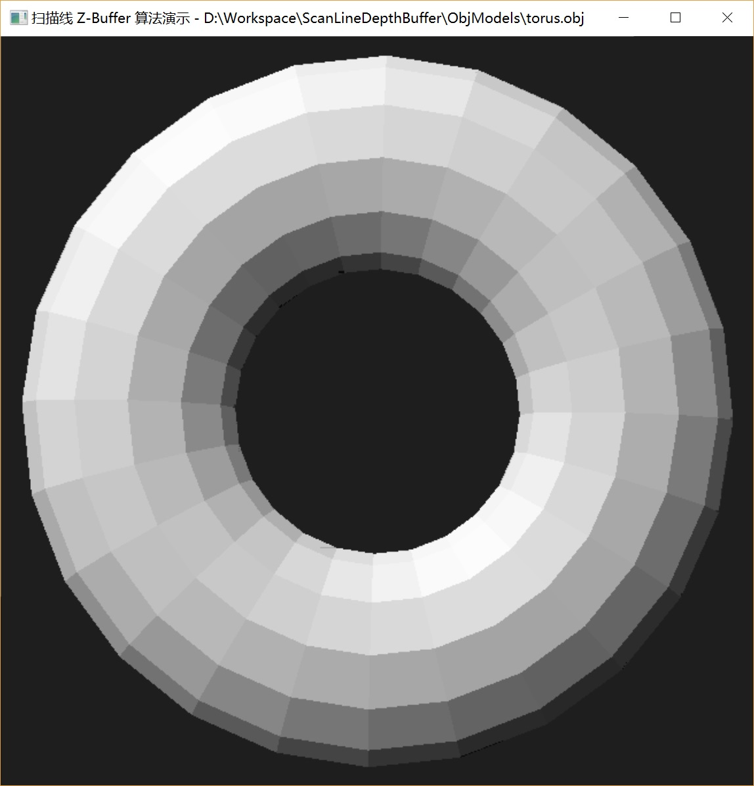

图 6-3 torus.obj

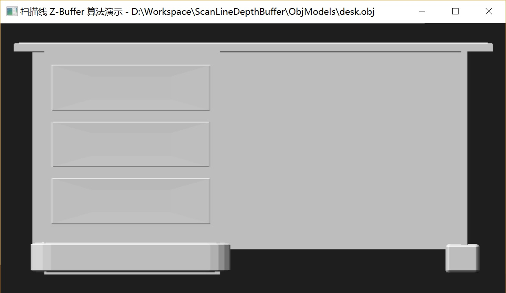

图 6-4 desk.obj

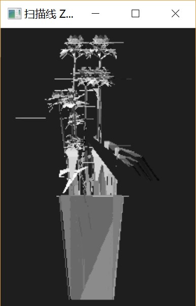

图 6-5 flowers.obj

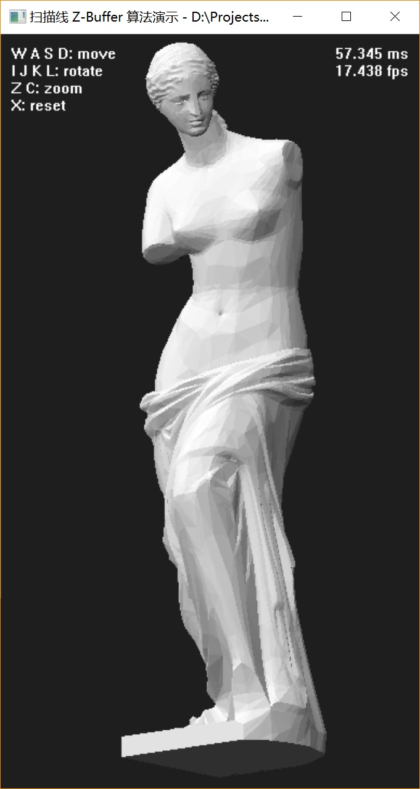

图 6-6 venus.obj

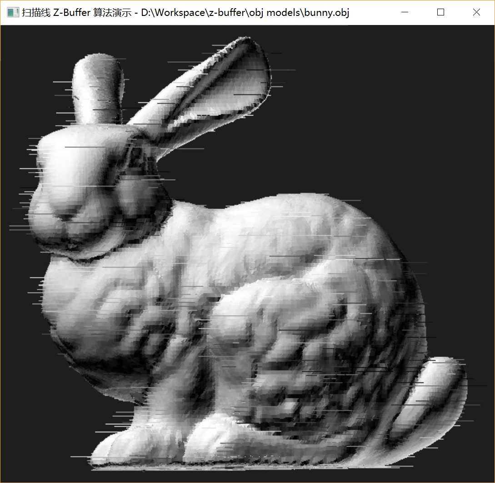

图 6-7 bunny.obj

## 7 存在的问题

~~(Fixed) 部分模型在缩放时会随机出现水平横线，部分模型在缩放时面片的颜色会发生跳变。~~

部分模型在缩放时会随机出现斑点，具体示例如图7-1中红圈部分所示。

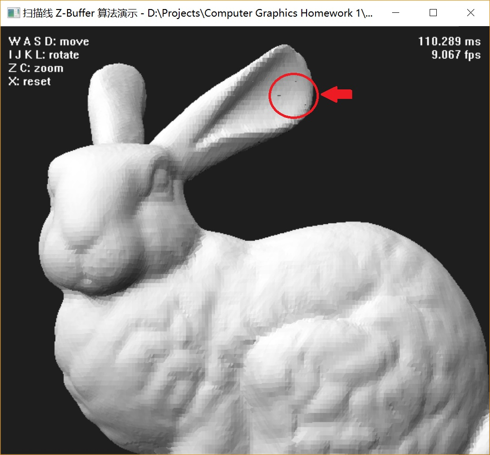

图 7-1 模型显示时的问题

不能显示部分凹多边形，示例如图7-2所示。

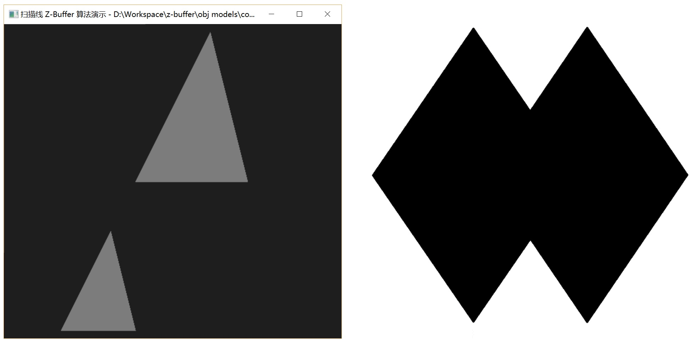

图 7-2 凹多边形显示问题，左图为实际结果，右图为理论图像

